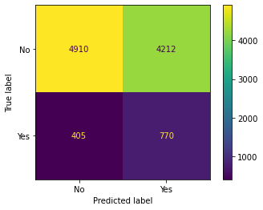
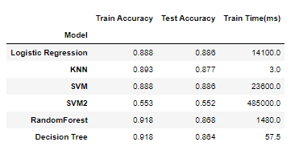
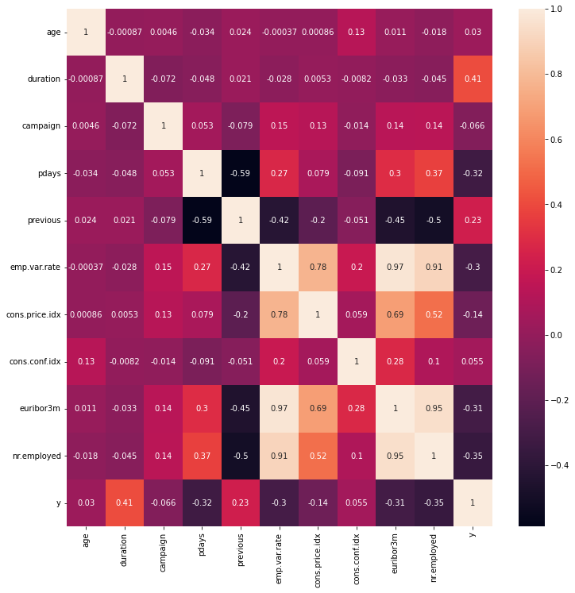
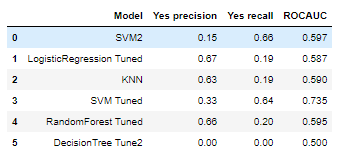
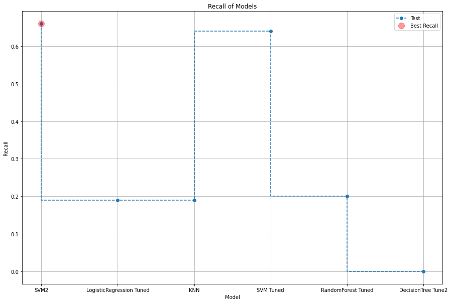
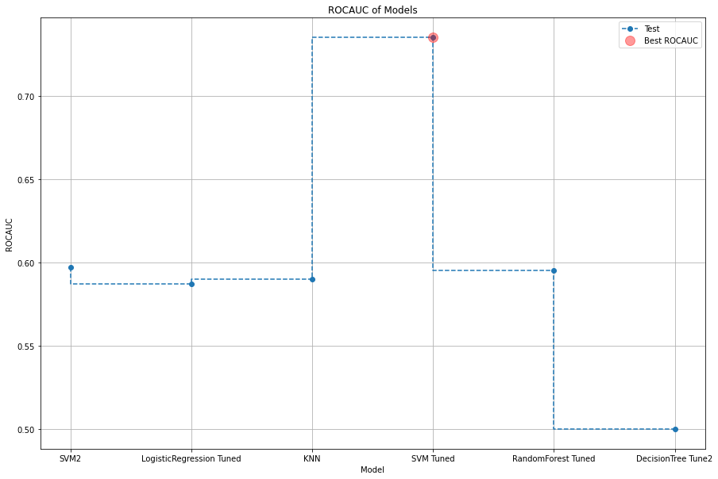
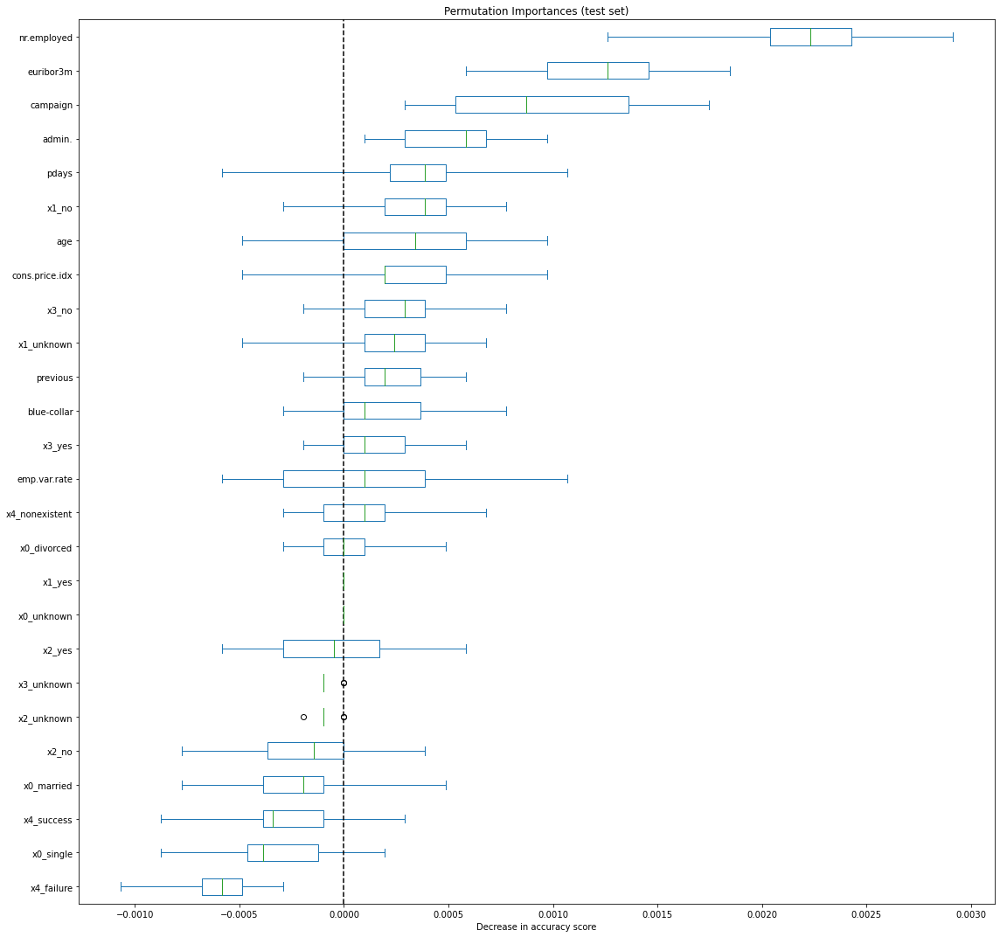
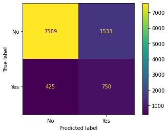

Clearly stated business understanding of problem:

The goal of this exercise is to find a model that best predicts if a
client will subscribe to a term deposit. This model should be helpful to
identify what aspects that make a client a good target to call.

Establish a baseline performance that our classifier should aim to beat.

Accuracy has to be above 88.7%; otherwise, simply just guessing the
client didn\'t subscribe to a term deposit, would be a more accurate
prediction.

{width="3.4166666666666665in"
height="2.7291666666666665in"}

Confusion Matrix of SVM Model 2:

This model catches the most true positive data points so far.
Unfortunately, it also has a lot of false positives. This is also the
least accurate model.

{width="3.8125in"
height="1.9479166666666667in"}

The least accurate model is also the most useful in predicting if
someone will open an account, thus accuracy isn\'t a good metric for
this task.

{width="6.5in"
height="6.708333333333333in"}

The heatmap above doesn\'t show anything but weak correlations to the y
column. The weak correlations it shows are to duration (which we are
going to drop) as well as the social and economic context attributes,
and those attributes seem highly correlated to each other. Thus, they
won\'t provide very much information on their own.

The dataset is imbalanced, - i.e., many more no\'s than yeses - so
accuracy isn\'t the performance metric to tune too.

Most of the models didn\'t do very well, so adding more features is
warranted to see if we can improve anything.

For example, should we keep the gender feature? Why or why not? There is
no feature gender, so we can not keep it.

Switching the primary metric to recall is appropriate - more importantly
to recall of Yes - since that is the goal of the model is to predict who
will say yes at the end of the call. The next set of models will tune
the hyperparameters trying to maximize recall.

Technical Findings:

{width="3.5416666666666665in"
height="1.7291666666666667in"}

{width="6.5in" height="4.375in"}

{width="6.5in"
height="4.347222222222222in"}

{width="6.5in"
height="6.097222222222222in"}

The tuned SVM model is the best of the models with the second highest
recall, the best ROCAUC, much lower false positives than the SVM Model2.
Since the dataset is imbalanced, tuning data with oversampling or
undersampling could be tried to improve performance of the models.

{width="3.4166666666666665in"
height="2.7291666666666665in"}

Confusion Matrix of SVM Tuned:

Nothing in the dataset is very important. This clearly shows the need to
have better and different data about the clients.

Findings:

The best model (tuned SVM model) still leaves a lot of room for
improvement, only predicting 64% of who will say yes. Therefore, it
still isn't very good at telling when a client is going to subscribe to
a term deposit.

More and different details about the client/interaction appear to be
required to better model who will say yes to subscribing.

The current set of features doesn't seem to describe well who would be
willing to subscribe.

While it can be used to help find which clients to first call, it will
inevitably miss opportunities.

Next steps and recommendations:

Go back to the drawing board and find more information about possible
clients.

Gather more data about the calls. Then rerun this process.

Find out how many potential clients don't like being called. Survey them
about getting an email or text rather than a call.

It would be good to find another way to market to these people, with
just 11.3 percent of clients saying yes (to subscribing); even if you
could call everyone, likely some other method would be more cost
effective, like an email, or in your banking app, or an ad for it.

Try something different.

[[https://github.com/jwcitta/Practical-Application-Assignment-17.1-Comparing-Classifiers/blob/main/prompt_III.ipynb]{.underline}](https://github.com/jwcitta/Practical-Application-Assignment-17.1-Comparing-Classifiers/blob/main/prompt_III.ipynb)
